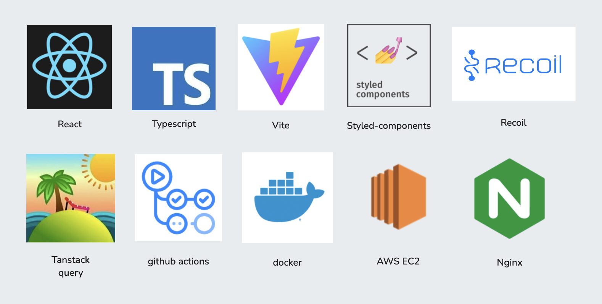

## 프로젝트 소개

<p align="center">
  
</p>

<p>
  비슷한 관심사를 가진 사람들과 쉽게 소통할 수 있는 플랫폼을 제공합니다. 실시간 채팅과 커뮤니티를 통해 사용자들이 자유롭게 의견을 나눌 수 있는 공간을 통해 친구를 추천해 드립니다.
</p>

## 🔑 주요 기능

- 사용자의 관심사에 맞는 사람들을 추천해드립니다.
- 관심사를 기반으로 유사한 사람들을 찾아 친구 요청을 보낼 수 있습니다.
- 실시간 알림 기능으로 친구 요청 및 채팅방 초대를 즉시 확인할 수 있습니다.
- 비슷한 관심사를 가진 사람들과 실시간으로 채팅을 나눌 수 있습니다.

## 🛠️ 기술 스택



## 👥 컨트리뷰터

<table align="center">
  <tr>
    <td align="center">Frontend</td>
    <td align="center">Frontend</td>
    <td align="center">Frontend</td>
  </tr>
  <tr>
    <td>
      <a href="https://github.com/iamkjw77">
        
      </a>
    </td>
    <td>
      <a href="https://github.com/itsmesunky">
        
      </a>
    </td>
    <td>
      <a href="https://github.com/GangHub1970">
        
      </a>
    </td>
  <tr>
  <tr>
    <td align="center">
      🍓<a href="https://github.com/iamkjw77">지원</a>
    </td>
    <td align="center">
      🫐 <a href="https://github.com/itsmesunky">선우</a>
    </td>
    <td align="center">
      🥑 <a href="https://github.com/GangHub1970">윤강</a>
    </td>
  </tr>
</table>

## 🚀 시작하기

프로젝트를 로컬 환경에서 실행하는 방법입니다.<br />
프로젝트를 실행하시기 전에 노션에 있는 **프론트 앤드 > 환경 변수 값**에 작성된 파일을<br />
프로젝트 루트에 만들어 코드를 붙여 넣어주세요.

**1. 프로젝트 클론**

```shell
git clone https://github.com/Friends77/FRI-FRONT.git
cd FRI-FRONT
```

**2. 의존성 설치**

```shell
npm install
```

**3. 개발 서버 실행**

```shell
npm run dev
```
